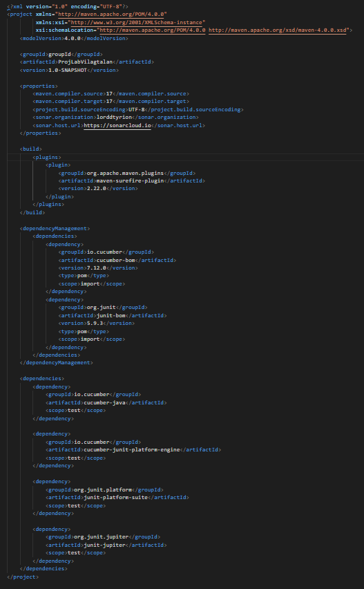
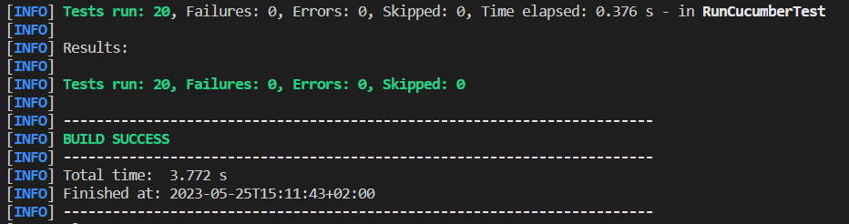

Motyovszki András:  
A bdd teszteket a cucumber segítségével készítettük el. Először felmentem a cucumber.io oldalra, az ott leírtak alapján módosítottam a pom.xml-t, hogy a projekt tudja futtatni a cucumber teszteket. A beüzelemelés nem sikerült első próbálkozásra, mert hiányzott néhány junit-os dependency, surefire plugin. A megfelelő dependency-k beállítása után is volt még probléma, a mappaszerkezetből eredően. Ennek megoldásához törölni kellet a .classpath és a .project fileokat, majd kijavítani a packageneveket a java fileokban (ProjLabVilagtalan-ra).

A pom.xml:

Ezek után sikeresen felismerte a projekt a szükséges dependencyket, alkalmas lett cucumber tesztek futtatására.

Majd megírtam a következő teszteket:
1. use_virus_on_virologist_with_gloves  
    Virológus vírust ken, a másiknak kesztyűje van  
    Leírás: Két virológus van ugyanazon mezőn, az egyikük Chorea vírust használ a másikon, aki a kesztyűjével visszaveri.  
    Ellenőrzött funkcionalitás: Annak ellenőrzése, hogy a kesztyű vissza tud kenni.
2. use_virus_both_have_gloves  
    Virológus vírust ken, a mindkettőnek kesztyűje van  
    Leírás: Két virológus van ugyanazon mezőn, az egyikük Chorea vírust használ a másikon, aki a kesztyűjével visszaveri, de az elsőnek is van, így a hatás elveszik.  
    Ellenőrzött funkcionalitás: Annak ellenőrzése, hogy a két kesztyűnél a hatás elveszik.
3. glove_breaks  
    Kesztyű eltörik  
    Leírás: Két virológus van ugyanazon mezőn, az egyikük Chorea vírust használ a másikon, aki a kesztyűjével visszaveri (egy „élete” volt), a kesztyű eltörik.  
    Ellenőrzött funkcionalitás: Annak ellenőrzése, hogy a kesztyű el tud törni.
4. use_vaccine_on_virologist  
    Virológus vakcinát ken  
    Leírás: Két virológus van ugyanazon mezőn, az egyikük AntiChoreát használ a másikon.  
    Ellenőrzött funkcionalitás: Vakcinakenés alapműködését ellenőrzi.
5. virologist_moves_by_chorea  
    Chorea hatás  
    Leírás: Egy virológuson hat a Chorea, véletlenszerűen lép (itt most az elsőre sorrendben).  
    Ellenőrzött funkcionalitás: Chorea működését ellenőrzi.
6. created_agent_expires  
    Létrehozott ágens lejár  
    Leírás: Egy virológusnál van egy legyártott AntiStun, az lejár és eltűnik.  
    Ellenőrzött funkcionalitás: Annak ellenőrzése, hogy a lejáró ágensek eltűnnek.

