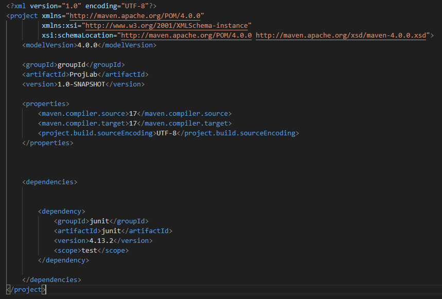
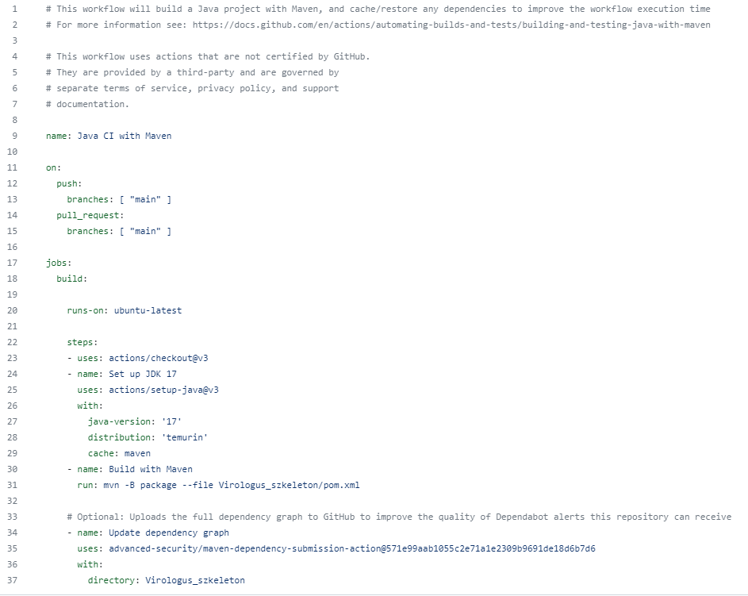
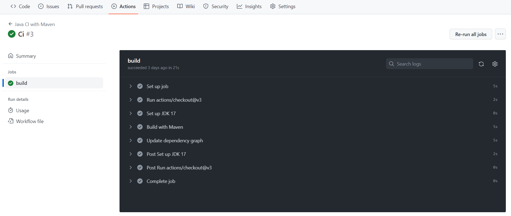

Pósa Tamás Márton:  
Hozzáadtam a projekthez a Maven keretrendszert, és a pom fájlt. 
pom.xml:

Motyovszki András:  
A github felületén létrehoztam egy github actiont a Continuous Integration-höz (Java with Maven). A projekthez hozzáadtam a maven.yml fájlt, mellyel felkonfiguráltam az ellenőzrést. Így minden github push után ellenőrzésre kerül, hogy le tudja-e buildelni a projektet. Első két alkalommal nem volt sikeres a build, mert nem adtam meg, hogy melyik mappában keresse a pom.xml-t, a dependencyket.

maven.yml:

ci sikeres buildelése a github felületen:
