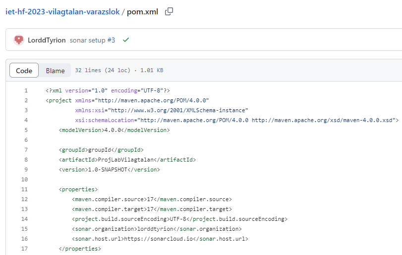

Baczó Domonkos:  
Az elején átnéztem a kód egy részét, de szabad szemmel komoly ahibát nem találtam (kisebb hibák voltak, például a kommentezés kódolása megváltozott, és így nem tudta megjeleníteni az ékezetes karaktereket, egy-két függvény túl hosszú vagy nem teljesen optimális).  

Ezután létrehoztam egy SonarCloud-analízist, amelyet összekötöttem a Github repositoryval. Ez nem volt egyszerű, mert csak artifactId megadásával sikerült. Az analízis pedig az első pár alakommal csak a pom.xml fájlra futott le, de aztán a mappaszerkezet megváltoztatása után már átvizsgálta az összes kódot, és talált 9 bugot, 7 security hotspot-ot és 190 code smell-t.  

Ezekből én javítottam ki a Random osztály használatából származó bugokat (hogy ne jöjjön létre mindig új), a code smellek közül pedig néhány blocker súlyosságút (a PlayArea osztályban a backgorund-ot átneveztem, mert van ilyen nevű tulajdonság Swingben, és egy függvénybern a & le lett cserélve &&-re - eredetileg szándékos volt, hogy a folyamatábra kedvéért mindkét ágat kiértékelje, de ez már nem optimális).

 
 
Le Ngoc Thai:
Én kijavitottam a Control osztály hibáit. Nem volt sok, csak a bufferedreadnél kellett a try with resource megoldásra átírni, amit ajánlott.

