Baczó Domonkos:  
A manuális teszteléshez a dokumentáció use case-ein mentünnk végig.  
A játék kezelőfelülete:

1. Mozgás  
  

Teszt előkészítése: új játék indítása 1 játékossal 
Tesztelési terv: A Move gombnál kiválasztottuk, hogy melyik mezőre akarunk lépni, és a gombra kattintunk.  
Teszt eredménye: sikeres, valóban a megadott mezőre lépett. 

2. Mozgásképtelenség  
  

Teszt előkészítése: új játék két játékossal, az elsőt egy laboratóriumba navigáltuk (kék mező). Ezt addig csináltuk, amíg vagy Chorea, vagy Stun vírust találtunk (ez esetben Chorea), és nem kapunk medvevírust. Elkészítjük a vírust a Create agent gombbal a vírus kiválasztása után. Ezután a másik játékost a szomszédos mezőre navigáltuk. 
Tesztelési terv: A vírussal felszerelt játékost a másik játékos mezőjére léptetjük, és a Use virus gomb mellett kiválasztjuk a vírust és a céljátákost, majd megnyomjuk a gombot. Ezután a másik játékossal lépni próbálunk. 
Teszt eredménye: sikeres, a másik játékos valóban nem tudott lépni (csak Chorea esetén a köre végén, random, ahogy a játékban kell). Az akciópontjai viszont fogytak, de ez nem baj, mert cselekvésképtelen a virológus.  

3. Tárgyfelvétel  
  
Teszt előkészítése: új játék indítása 1 játékossal 
Tesztelési terv: A Move gombbal elnavigálunk egy narancssárga mezőre (óvóhely), ahol van egy tárgy (kis kör). A pick up gombbal felvesszük. 
Teszt eredménye: sikeres, a tárgy a tárgylistában megjelent, és az eldobható dolgok között is ott van, a térképről eltűnt a kis kör. 

4. Sikertelen tárgyfelvétel  
  

Teszt előkészítése: 1. eset: Hasonló a második teszthez, csak az "áldozatot" egy óvóhelyre navigáljuk előtte. 2. eset: Egy játékossal összeszedünk háromféle tárgyat. 
Tesztelési terv: 1. eset: A vírussal felszerelt játékost a másik játékos mezőjére léptetjük, és a Use virus gomb mellett kiválasztjuk a vírust és a céljátákost, majd megnyomjuk a gombot. Ezután a másik játékossal megpróbálunk egy tárgyat felvenni. 2. eset: A játékossal elmegyünk egy negyedi óvóhelyre, és megpróbálunk tárgyat felvenni. Mindkét esetben az akció sikertelenségét várjuk. 
Teszt eredménye: sikeres, a játékosok nem tudtak tárgyat felvenni. Teli eszköztár esetén is fogytak az akciópontok, ez viszont nem felhasználóbarát. 

5. Aminosav felvétel  
  
Teszt előkészítése: új játék indítása 1 játékossal 
Tesztelési terv: A Move gombbal elnavigálunk egy piros mezőre (aminosav-raktár),a pick up gombbal felvesszük. 
Teszt eredménye: sikeres, a nyersanyagok között megjelent még 50 aminosav. 

Le Ngoc Thai:  

6. Nukleotid felvétel  
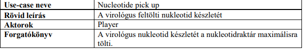  
Teszt előkészítése: új játék indítása 1 játékossal 
Tesztelési terv: A Move gombbal elnavigálunk egy rózsaszín mezőre (nukleotid-raktár),a pick up gombbal felvesszük. 
Teszt eredménye: sikeres, a nyersanyagok között megjelent még 50 nukleotidsav.

7. Ágens tanulás  
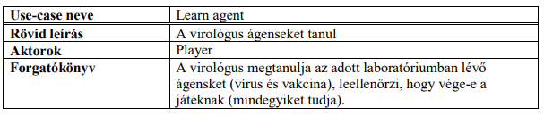

Teszt előkészítése: Új játék indítása 1 játékossal  
Tesztelési terv: A játékossal elnavigálunk a laboratóriumba, és ha nincs medve akkor a pick up gombra kattintva megtanulhatja az ágenst.  
Teszt eredménye: Sikeres, valóban megtanult egy ágenst.

8. Győzelem  
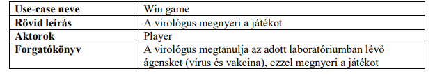

Teszt előkészítése: Új játék indítása 1 játékossal  
Tesztelési terv: A játékossal elmegyünk az óvóhelyekre,amíg nem találunk baltát, mert ez kell a medve legyőzéséhez.Minden óvóhelyen a pick up gombra kattintva felvesszük az itemeket.A medve egy véletlenszerű laboratóriumba van.Majd utána minden laboratóriumba elnavigálunk és megtanuljuk az ágenseket. Ha megtanultuk őket akkor megnyertük a játékot  
Teszt eredménye: Sikeres, valóban véget ért játék.

9. Nem tud lopni  
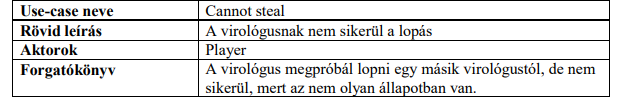

Teszt előkészítése: Új játék indítása 2 játékossal  
Tesztelési terv: 
Teszt eredménye: Sikeres, valóban nem sikerült lopni egy másik játékostól.

Motyovszki András:  

10. Lopás  
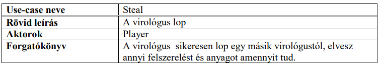  
Teszt előkészítése: Új játék indítása 2 játékossal. Az egyik játékost elnavigáljuk egy óvóhelyre, ahol a *Pick up* gombra nyomva felveszünk vele egy tárgyat (ne *Gloves* vagy *Cape* legyen). A másik játékost laborokba navigáljuk, hogy megtanulja a *Stun* vagy *Chorea* ágenst. Ezután a két játékost azonos mezőre navigáljuk.  
Tesztelési terv: A második játékossal (akivel nem vettünk fel tárgyat) készítünk egy *Stun* vírust (*Create agent* gomb) kiválasztjuk a *User virus* gomb mellet célpontot, majd megnyomjuk a gombot. Majd kiválasztjuk a *Steal gomb mellett a célpontot és megnyomjuk a gombot. 
Teszt eredménye: Sikeres, a második játékosnál van az első összes anyaga, és tárgya.  

11. Ágens létrehozása  
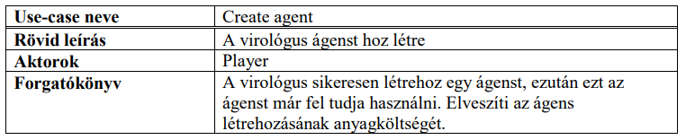  
Teszt előkészítése: Új játék kezdése 1 játékossal. A játékost egy laborba navigáljuk, ahol a *Pick up* gomb megnyomásával megtanulja az ott található ágenst.  
Tesztelési terv: A *Create agent* gomb mellett kiválasztjuk a létrehozni kívánt ágenst, majd megnyomjuk a gombot.  
Teszt eredménye: Sikeres, a játékosnál megjelent, hogy van egy elkészített ágense, és csökkent az anyagkészlete.  

12. Nincs elég anyag ágens létrehozásához  
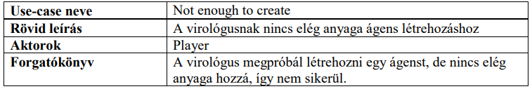  
Teszt előkészítése: Új játék indítása 1 játékossal. A játékost egy laborba navigáljuk, ahol a *Pick up* gomb megnyomásával megtanulja az ott található ágenst. A *Create agent* gombot megnyomva létrehozunk egy ágenst, hogy csökkentjen a virológus anyagkészlete.  
Tesztelési terv: Megnyomjuk még egyszer a *Create agent* gombot.  
Teszt eredménye: Sikeres, nem jött létre új ágens.  

13. Vírus használata  
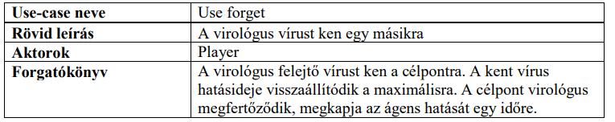  
Teszt előkészítése: Új játék indítása 2 játékossal. Az első játékost egy laborba navigáljuk, ahol a *Pick up* gomb megnyomásával megtanul egy ágenst. Ezután a két játékost azonos mezőre navigáljuk. Az első játékossal létrehozunk egy vírust, a *Create agent* gomb mellett kiválasztjuk, majd megnyomjuk a gombot.  
Tesztelési terv: Az első játékossal a *Use virus* gomb mellett kiválasztjuk a használni kívánt vírust és a célpontot, majd megnyomjuk a gombot.  
Teszt eredménye: Sikeres, az első virológus ágene elhasználódott, a második virológuson pedig van egy aktív vírus.  

  Pósa Tamás Márton:  

14. Vakcina véd  
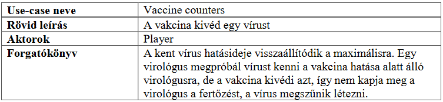  

Teszt előkészítése: új játák indítása 2 játékossal, mindkettőt eljuttatni azonos laboratóriumba (kék mező) 
Tesztelési terv: Az egyik virológus vakcinát gyárt (Create agent) és ken magára (Use vaccine), míg a másik vírust gyárt (Create agent) és az előzőre keni (Use virus).  
Teszt eredménye: sikeres, a vakcinával rendelkező virológus nem kapta meg a vírust.  

15. Köpeny használat 
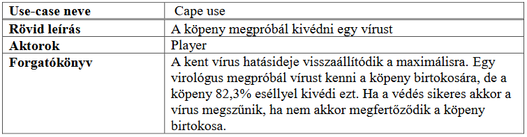  

Teszt előkészítése: új játék indítása 2 játékossal, az elsőt egy laboratóriumba (kék mező) navigálni, a másodikat pedig egy köpenyhez (sárga mező, ha kesztűt vesz fel, újra kell kezdeni). Az első elkészíti a vírust (Create agent).  
Tesztelési terv: Az első virológus a másodikra keni a vírusát (Use virus). 
Teszt eredménye: sikerers, a köpeny sikeresen kivédte a vírust (ennek volt nagyobb az esélye).   

16. Egy kesztyű használata 
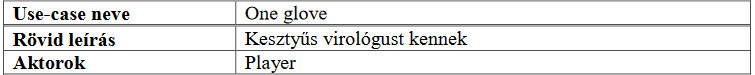
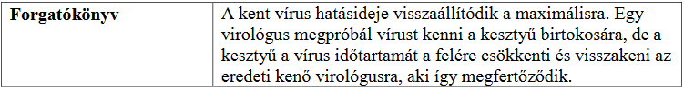  

Teszt előkészítése: új játék indítása 2 játékossal, az elsőt egy laboratóriumba (kék mező) navigálni, a másodikat pedig egy kesztyűhöz (sárga mező, ha köpenyt vesz fel, újra kell kezdeni). Az első elkészíti a vírust (Create agent).  
Tesztelési terv: Az első virológus a másodikra keni a vírusát (Use virus). 
Teszt eredménye: sikeres, a kesztyű sikeresen kivédte, csökkentette a maximális használatát és visszakente a vírust az időtartam felével.   

17. Két kesztyű használata 
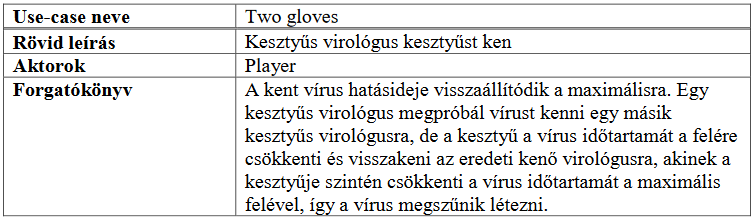  

Teszt előkészítése: új játék indítása 2 játékossal, az elsőt egy laboratóriumba (kék mező), majd kesztyűhöz (sárga mező, ha köpenyt vesz fel, újra kell kezdeni) navigálni, a másodikat pedig egy kesztyűhöz (sárga mező, ha köpenyt vesz fel, újra kell kezdeni). Az első elkészíti a vírust (Create agent).  
Tesztelési terv: Az első virológus a másodikra keni a vírusát (Use virus). 
Teszt eredménye: sikeres, a vírus eltűnt és mindkét kesztű vesztett egyet a tartósságából.   
